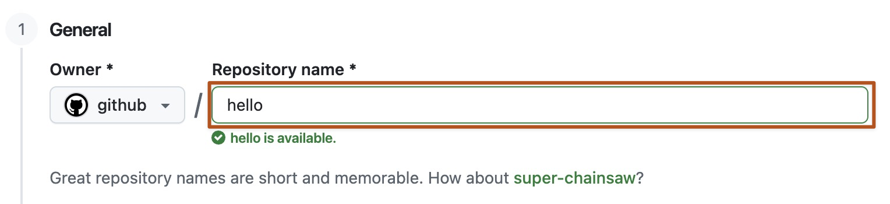
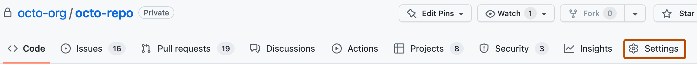

# BIOS6301 student materials

## Start here: online course site

### [Open the BIOS6301 online course site](https://slzhao.github.io/BIOS6301-materials/)

The website is the **primary source for course reading**. This GitHub repository
provides the corresponding Quarto source, R code, synthetic data, and lab
starters.

First-time setup is taught in the supervised [Session 2 Git
lab](course/session02/lab.qmd). Complete the [before-Session-2
preparation](course/session02/preclass.qmd) before class. The instructions below
are the permanent reference for repeating or repairing that setup.

## 1. Create an empty private GitHub repository

Open GitHub's [new-repository page](https://github.com/new?name=BIOS6301-mywork&visibility=private)
and create `BIOS6301-mywork`.



Before selecting **Create repository**, verify:

- **Visibility:** Private
- **Add README:** Off
- **Add `.gitignore`:** None
- **Choose a license:** None

Do not initialize the repository with any files. It must be empty before the
course history is pushed to it.

*Image source: [GitHub Docs](https://docs.github.com/en/repositories/creating-and-managing-repositories/creating-a-new-repository). The appearance may change slightly over time.*

## 2. Give course staff access to the private repository

Open `BIOS6301-mywork` on GitHub and select **Settings**:



Under **Access**, select **Collaborators → Add people**. Send invitations to:

- instructor: `slzhao`; and
- TA: `zongyue.teng@Vanderbilt.Edu`.

An invitation may remain **Pending** until the recipient accepts it. Keep the
repository private. Course staff need access to read the submitted files and Git
history. For a private repository owned by a personal account, GitHub grants
collaborators write access as well; course staff will not edit student
repositories.

See [GitHub's collaborator instructions](https://docs.github.com/en/repositories/managing-your-repositorys-settings-and-features/repository-access-and-collaboration/inviting-collaborators-to-a-personal-repository)
if the interface differs from the screenshot.

## 3. Clone the public course repository through RStudio

In RStudio, select **File → New Project → Version Control → Git**.

Use:

```text
Repository URL:       https://github.com/slzhao/BIOS6301-materials.git
Project directory:    BIOS6301-mywork
```

When the New Project Wizard appears, choose **Version Control**:


After RStudio finishes cloning, keep the repository-root project open. The Git
tab and Git menu should be visible:


The project contains `BIOS6301-materials.Rproj`; open that root project whenever
you return to the course. Do not create another repository inside `work/`.

*RStudio images source: [Posit RStudio User Guide](https://docs.posit.co/ide/user/ide/guide/tools/version-control.html).*

<details>
<summary>Terminal alternative for cloning</summary>

```bash
git clone https://github.com/slzhao/BIOS6301-materials.git BIOS6301-mywork
cd BIOS6301-mywork
```

Then open `BIOS6301-materials.Rproj` in RStudio.

</details>

## 4. Connect the private repository and authenticate

Immediately after a new clone, the name `origin` points to the public instructor
repository. Preserve it as `upstream`, then connect the empty private repository
as `origin`:

```bash
git remote rename origin upstream
git remote add origin https://github.com/YOUR_GITHUB_USERNAME/BIOS6301-mywork.git
git push -u origin main
```

If `git remote -v` already shows your private repository as `origin` and the
instructor repository as `upstream`, do not repeat these commands; continue with
the verification step.

The first private Push may open GitHub in a browser through Git Credential
Manager. Sign in, complete two-factor authentication, authorize the helper if
requested, and return to RStudio.

On macOS or Linux, students using GitHub CLI can prepare browser authentication
with:

```bash
gh auth login
```

Choose **GitHub.com → HTTPS → Yes → Login with a web browser**.

If the Terminal requests your ordinary GitHub account password, cancel. GitHub
does not accept account passwords for Git operations; do not paste a password or
personal access token.

## 5. Verify the two remotes

```bash
git remote -v
```

The addresses should have these roles:

```text
origin    your private BIOS6301-mywork repository
upstream  the public instructor BIOS6301-materials repository
```

Open your private repository on GitHub and confirm that it contains the course
files and commit history. This successful Push verifies HTTPS authentication.

## Ownership rule

- Do not edit tracked files under `course/`.
- Copy starters into `work/` and edit the copies.
- R-based labs provide equivalent `.Rmd` and `.qmd` starters. Choose one format
  for each work copy; Knit `.Rmd` or Render `.qmd`.
- Commit your work before merging course updates.

## Update course materials

Run the supplied recipe only when your own work is committed and the Git pane is
understood:

```bash
git status
git fetch upstream
git merge upstream/main
git push origin main
```

If Git reports a conflict, stop and preserve all files before attempting a
repair. Never use force Push for a course update.

## Authentication troubleshooting

- **Browser does not open:** preserve local commits and ask the instructor or TA
  to check Git Credential Manager or `gh auth status`.
- **Terminal asks for a GitHub password:** cancel; repair the credential helper.
- **Wrong GitHub account opens:** sign out in the browser or clear the incorrect
  cached GitHub credential with instructor or TA assistance.
- **Push is rejected:** do not force Push; identify which remote contains the
  missing commits first.
