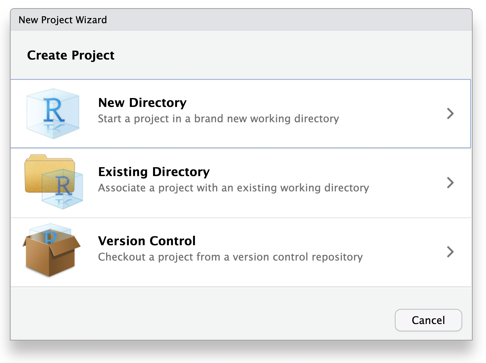
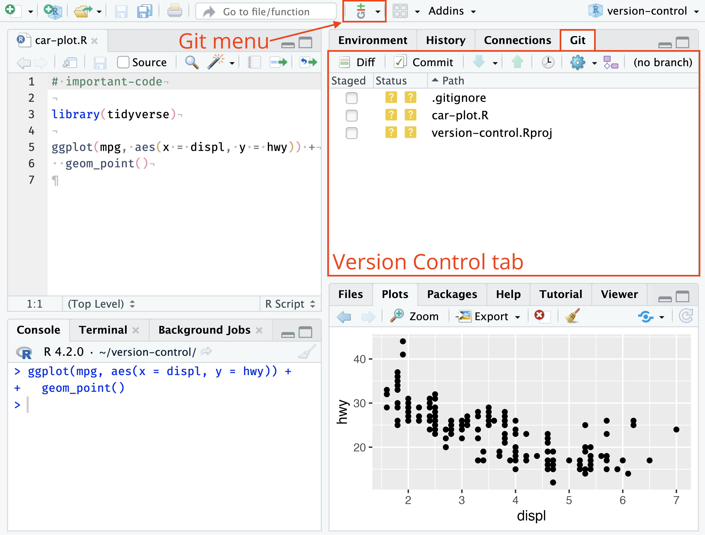

::: {.callout-note}
**Suggested use:** complete the supervised setup checkpoint first. Checkpoints
1–6 then create three small commits through the RStudio Git interface. The
additional practice is a longer route that can be completed independently.
:::

## Goal

Use separate RStudio projects for course updates and your own work.

## Setup checkpoint: two separate clones

### Part A: clone the course materials

1. Select **File → New Project → Version Control → Git**.
2. Paste `https://github.com/slzhao/BIOS6301-materials.git`.
3. Name the directory `BIOS6301-materials` and select **Create Project**.
4. Open `BIOS6301-materials.Rproj`; check that the Git pane is empty.
5. Click **Pull** and read the result. Repeat this before every class.

{fig-alt="RStudio New Project Wizard" width="76%"}

{fig-alt="RStudio project and Git controls" width="88%"}

*Images: [Posit RStudio User Guide](https://docs.posit.co/ide/user/ide/guide/tools/version-control.html).*

In this project's Terminal, `git remote -v` should show the instructor's
`BIOS6301-materials` address as `origin`. Leave all course files unchanged.

### Part B: clone your independent private repository

Use the private `BIOS6301-mywork` repository prepared before class, containing
a README and the R `.gitignore`. If it is empty, add a README on GitHub first.

1. Select **File → New Project → Version Control → Git** again.
2. Paste `https://github.com/YOUR_GITHUB_USERNAME/BIOS6301-mywork.git`.
3. Name the directory `BIOS6301-mywork`.
4. Place it **beside** the course clone, never inside it.
5. Complete browser authentication if requested.
6. Open `BIOS6301-mywork.Rproj`. If necessary, create this root project with
   **File → New Project → Existing Directory** in the cloned folder.

Check `git remote -v`: this project's `origin` must point to your private
repository. No instructor remote is needed. Each project has its own `origin`;
always check the open project before using Pull or Push.

If Git asks for your ordinary GitHub password, cancel and return to the
[HTTPS preparation guide](preclass.qmd).

### Part C: verify staff access

In your private repository, select **Settings → Collaborators → Add people**.
Invite `slzhao` and `zongyue.teng@Vanderbilt.Edu`. Keep it private.

{width="100%"}

*Source: [GitHub collaborator instructions](https://docs.github.com/en/repositories/managing-your-repositorys-settings-and-features/repository-access-and-collaboration/inviting-collaborators-to-a-personal-repository).*

### Already using the earlier combined setup?

Preserve the existing folder and all answers. Ask the TA to help establish a
separate course clone and personal project. Do not overwrite work or delete
history to follow these instructions.

## Start the core lab in your personal project

1. Copy the complete `BIOS6301-materials/course/session02/starter/` folder to
   `BIOS6301-mywork/work/session02-git-lab/` using your file manager.
2. Keep **BIOS6301-mywork.Rproj** open in RStudio.
3. In the copied `analysis/` folder, choose `report.Rmd` or `report.qmd` and
   remove the unused alternative from the copy.
4. If RStudio created a root project file, commit it first with
   `Add personal RStudio project`. The three lab commits below are separate.
5. Do not create another Git repository inside the lab folder.

The Git pane should now list the copied lab files as new or untracked.

## Checkpoint 1: Read the Git pane

Before staging anything:

1. Identify each copied file in the Git pane.
2. State why it appears.
3. Open `.gitignore` and identify which generated or local files it excludes.
4. Confirm that no credential, protected data, or unrelated file is listed.

Do not check every box until you understand every path.

## Checkpoint 2: Commit the analysis skeleton

1. Click **Commit** to open **Review Changes**.
2. Choose one copied file and inspect its diff.
3. Check the **Staged** box only after reviewing the file.
4. Repeat for `.gitignore`, `README.md`, your chosen `analysis/report.Rmd` or
   `analysis/report.qmd`, and `data/study_summary.csv`.
5. Switch between the **Staged** and **Unstaged** views. Confirm that staged
   snapshots exist for the intended four files—and no others.
6. Enter the message `Add reproducible analysis skeleton`.
7. Click **Commit** and read the result message.
8. Open **History** and locate the new commit.

Explain why this commit exists locally before it is pushed to GitHub.

## Checkpoint 3: Add a calculation

Open your chosen `work/session02-git-lab/analysis/report.Rmd` or `report.qmd` and
add a named object containing the mean outcome. Knit or Render and verify the
result.

Then use RStudio:

1. Return to the Git pane and refresh it.
2. Confirm that the chosen report source is listed as modified.
3. Confirm that the rendered HTML is absent because it is ignored.
4. Open **Diff** and identify the exact calculation added.
5. Stage only the chosen `.Rmd` or `.qmd` source.
6. Commit with the message `Calculate mean outcome`.
7. Verify that History now contains two lab commits.

## Checkpoint 4: Add an interpretation

Add one sentence that reports and interprets the calculated mean. Render and
check that the prose agrees with the calculation.

In **Review Changes**:

1. inspect the prose diff;
2. stage the source;
3. commit with `Add interpretation of mean outcome`; and
4. inspect all three lab commits in History.

## Checkpoint 5: Stage and unstage safely

Add this harmless temporary sentence to the copied `README.md`:

```text
Temporary staging practice.
```

1. Save and inspect the diff.
2. Check **Staged**.
3. Switch to the staged-diff view and confirm that its snapshot contains the
   sentence.
4. Uncheck **Staged**.
5. Confirm that the sentence remains in the working file.

This demonstrates that unchecking **Staged** stops preparing that snapshot for
the next commit; it does not change the working file.

After inspecting it again, use **Revert** to erase this known disposable edit.
Read the confirmation dialog before proceeding, and confirm that the file returns
to its committed state.

## Checkpoint 6: Push the recorded history

1. Confirm that the Git pane is empty.
2. Open History and reread the three messages.
3. Click **Push**.
4. The saved HTTPS credential should normally be reused. If GitHub opens again,
   complete sign-in and two-factor authentication there, then return to RStudio.
5. Read the result and confirm that the push succeeded.
6. Open your private GitHub repository and locate the three commits.

If the push is rejected, do not force push. Preserve the local work and ask the
instructor or TA to help identify which remote contains additional commits.

## Update the course before each class

1. Save your personal work and open **BIOS6301-materials.Rproj**.
2. Confirm its Git pane is empty, click **Pull**, and read the result.
3. Read the updated materials.
4. Switch back to **BIOS6301-mywork.Rproj** to work.

Course updates affect only the course clone. Copy new starters deliberately;
never overwrite a completed lab with a fresh starter.

## Additional practice: use the interface deliberately

1. Make one meaningful edit to your chosen report source and a different edit
   to `README.md`. In Review Changes, stage only the analysis, commit it, then
   commit the documentation separately. Explain why two commits are clearer
   than one.
2. Open History and compare each new commit with its parent. Identify the exact
   commit that introduced the analysis change.
3. Render the report again. Verify that the HTML remains on disk but absent from
   the Git pane. Explain the role of `.gitignore` without saying that it deletes
   anything.
4. Add a disposable line, stage it, unstage it, and verify the working edit
   remains. Then remove it by editing normally rather than using Revert.
5. Draw the three locations—working files, local commit history, and private
   GitHub `origin`—and label which RStudio action moves information between them.
6. Check each project's `origin` and explain why Pull updates different files
   depending on which RStudio project is open.
7. Examine this situation without performing any recovery: a file is modified,
   the Push button reports a rejection, and a classmate suggests force push.
   Write the safe next steps and explain why force push is inappropriate.

### Independent-practice check

Finish with an empty Git pane and a readable history. You should be able to show
which commit introduced each analytical idea, and you should be able to explain
why no command was needed for the everyday review–stage–commit cycle.

## Exit evidence

Show the instructor or TA:

- an empty RStudio Git pane;
- History containing the three core commits;
- the line-by-line diff for one chosen commit;
- a successful Push result; and
- `git remote -v` in each project showing its separate, correct `origin`;
- the browser address of the private `BIOS6301-mywork` repository; and
- **Settings → Collaborators** showing invitations for the instructor and TA.

Explain the difference between a saved edit, a staged change, a local commit,
and a commit pushed to GitHub.
