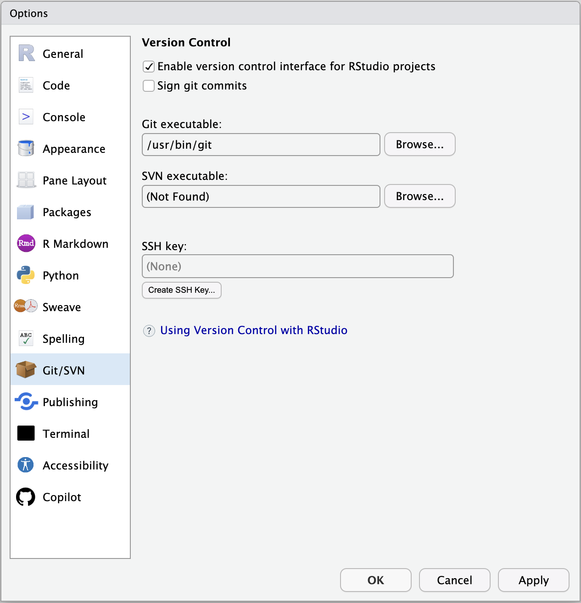

::: {.callout-important}
Do **not** clone `BIOS6301-materials` or configure course remotes for this
preparation. The supervised Session 2 lab begins with those steps.
:::

## 1. Verify Git

The following commands are one-time setup checks, not syntax to memorize.

Open RStudio, select the **Terminal** tab, and run:

```bash
git --version
```

Copy the output. If the command is not recognized, install the current version
of [Git](https://git-scm.com/download/) and restart RStudio.

On Windows, use the regular **Git for Windows Setup** installer and accept its
default credential-helper option. Do not choose Portable Git for the standard
course setup: portable or application-bundled Git copies may omit GCM or may
not configure it for the Windows account.

## 2. Configure your commit identity

First, check whether Git already has an identity for you:

```bash
git config user.name
git config user.email
```

If both values are present and correct, **do not change them**. Students with
previous Git experience may already have appropriate settings.

If either value is missing or incorrect, set the default identity for new
commits on this computer:

```bash
git config --global user.name "Your Name"
git config --global user.email "EMAIL_ASSOCIATED_WITH_GITHUB"
```

Then verify the effective values:

```bash
git config user.name
git config user.email
```

::: {.callout-important}
This is **not** your GitHub username, password, or login.

- `user.name` is normally your human-readable name.
- `user.email` is recorded in every new commit together with your name.
- GitHub can connect the commit to your account when the email is verified on
  that account. You may instead use the private `noreply` address shown under
  **GitHub → Settings → Emails**.
- GitHub authentication is a separate browser sign-in covered in Step 4.

Never place a password or access token in `user.name` or `user.email`.
:::

The `--global` option makes these values the default for repositories used by
your computer account. A repository-specific setting can override them later.
Changing the setting affects future commits; it does not rewrite earlier
commits.

## 3. Verify RStudio can find Git

In RStudio, open **Tools → Global Options → Git/SVN**.

Confirm that:

1. **Enable version control interface for RStudio projects** is checked; and
2. a path appears beside **Git executable**.

{fig-alt="RStudio Git/SVN options showing the enabled version-control interface and a detected Git executable" width="78%"}

*The exact Git path depends on the operating system. The SSH-key field can remain
empty because BIOS6301 uses HTTPS. Image source: [Posit RStudio User
Guide](https://docs.posit.co/ide/user/ide/guide/tools/version-control.html).*

## 4. Prepare and check HTTPS browser authentication

This course uses HTTPS repository URLs. GitHub does **not** accept an ordinary
account password for Git pushes. A credential helper will authenticate through
GitHub in a browser and store the resulting credential securely.

You need **one** of the following methods, not both.

### Method A: Git Credential Manager

Current Git for Windows includes Git Credential Manager (GCM), but GCM is not
included with every Git installation on every operating system. Check for it:

```bash
git credential-manager --version
```

A successful check prints a version number. **Blank output is not success.**
If a version is displayed, authenticate in a browser before class:

```bash
git credential-manager github login --username YOUR_GITHUB_USERNAME --browser
git credential-manager github list
```

The second command should list the GitHub account saved by GCM. Do not display,
copy, or submit any token.

If `git credential-manager` is unavailable on Windows, update Git using the
official [Git for Windows installer](https://git-scm.com/download/win) and keep
its default Git Credential Manager option. This includes cases where the command
prints nothing. Alternatively, keep the portable Git copy and use Method B.

### Method B: GitHub CLI

GitHub CLI is a supported alternative on Windows, macOS, and Linux. Install
[GitHub CLI](https://cli.github.com/) and verify:

```bash
gh --version
```

Then authenticate through the browser and configure Git to use that login:

```bash
gh auth login --hostname github.com --git-protocol https --web
gh auth setup-git
gh auth status --active --hostname github.com
```

When asked whether Git should use your GitHub credentials, answer **Yes**. The
final command should display the active GitHub username and report that the
account is logged in. Do not use the `--show-token` option.

::: {.callout-note}
There is no HTTPS username-and-password test analogous to
`ssh -T git@github.com`. That command tests an **SSH key**, while this course
uses HTTPS. Browser login followed by the GCM account list or `gh auth status`
is the appropriate preparation check. The first Push to your private repository
in the supervised lab remains the final end-to-end test.
:::

If neither method is ready, bring the error message to class. You can still
complete local Git work, but the course's browser-based private Push/Pull
workflow is not ready until an HTTPS credential helper is configured.

## 5. Create an empty private GitHub repository

Open GitHub's [new-repository page](https://github.com/new?name=BIOS6301-mywork&visibility=private)
and create a private repository named `BIOS6301-mywork`.

{width="92%"}

Before selecting **Create repository**, verify:

- **Visibility:** Private
- **Add README:** Off
- **Add `.gitignore`:** None
- **Choose a license:** None

Do not initialize the repository with any files. We will connect the instructor
history to this empty repository during the supervised lab.

Have its HTTPS URL available:

```text
https://github.com/YOUR_GITHUB_USERNAME/BIOS6301-mywork.git
```

Do not paste credentials into the URL or any course file.

## 6. Invite the instructor and TA

The repository must remain private, but the instructor and TA need access to
review homework and its Git history.

Open `BIOS6301-mywork` on GitHub and select **Settings**:

{width="100%"}

Then:

1. In the left sidebar under **Access**, select **Collaborators**.
2. Select **Add people**.
3. Search for and invite the instructor: `slzhao`.
4. Select **Add people** again and invite the TA using
   `zongyue.teng@Vanderbilt.Edu`.
5. Confirm that both invitations are listed. They may remain **Pending** until
   the recipients accept them.

Do not make the repository public and do not invite classmates. On a private
repository owned by a personal GitHub account, collaborator access includes
write access. Course staff will use that access only to view and grade your
course work; they will not edit your repository.

*Interface image and procedure source: [GitHub Docs — Inviting collaborators to
a personal repository](https://docs.github.com/en/repositories/managing-your-repositorys-settings-and-features/repository-access-and-collaboration/inviting-collaborators-to-a-personal-repository). The appearance may change slightly over time.*

## 7. Test access to the private repository

After creating the empty private repository, run this read-only command with
your username substituted:

```bash
git ls-remote https://github.com/YOUR_GITHUB_USERNAME/BIOS6301-mywork.git
```

Copy the command from the code block and replace only
`YOUR_GITHUB_USERNAME`. The URL must be plain text: do not include Markdown
brackets or parentheses such as `[https://...](https://...)`.

This may open the browser sign-in prepared in Step 4. Because the repository is
empty, a successful check may return to the Terminal prompt without listing any
branches. **No authentication error** means that Git can read the private
repository using the configured HTTPS helper. This command does not modify or
clone the repository.

::: {.callout-warning}
If the Terminal asks for **Username** and **Password** instead of opening a
browser, press `Ctrl+C`. Do not enter your GitHub password: GitHub does not
accept account passwords for Git operations. Return to Step 4, complete either
the GCM browser login or the GitHub CLI browser login, and then retry this
command.
:::

This is the closest useful HTTPS preparation test for this course. It tests the
actual private repository rather than a public URL, which would not require
authentication. The supervised first Push remains the test of write access.

## 8. Bring this evidence to class

Have the following available to show the instructor or TA:

```bash
git --version
git config user.name
git config user.email
```

Also have the empty private repository open in your browser and confirm that the
two course-staff invitations appear under **Settings → Collaborators**. You may
obscure part of the email address in a public discussion post.
