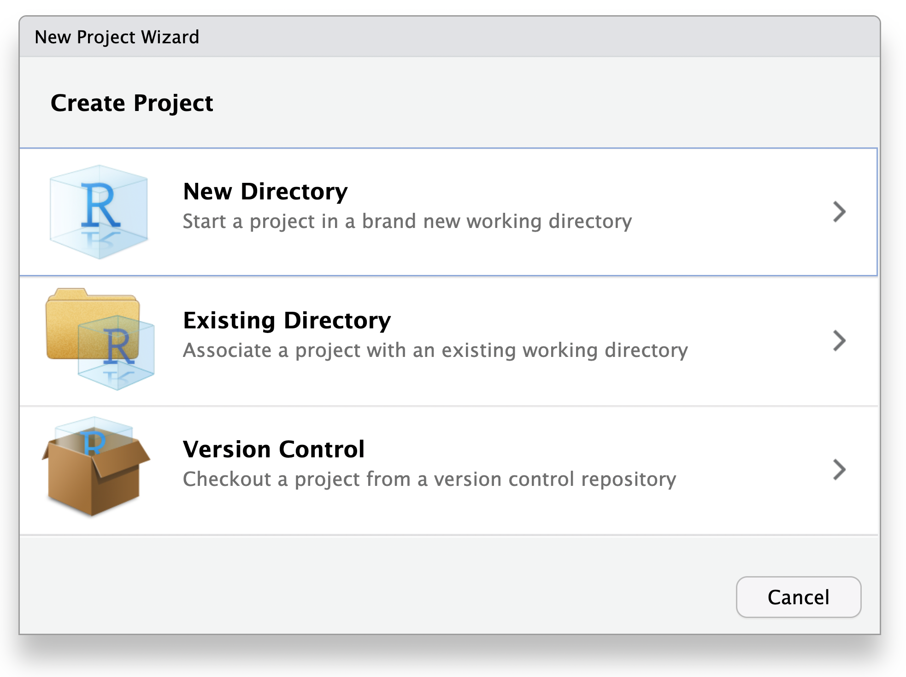

## The question behind this session {.smaller}

::: {.question}
Six weeks from now, can you identify **which version** of an analysis produced
Table 1—and explain exactly what changed immediately before it?
:::

. . .

Git turns a changing analysis into an inspectable sequence of checkpoints.

It is not primarily a homework-upload tool.


## What you should be able to do {.smaller}

[1]{.objective-num} Explain why version control matters for statistical work.

[2]{.objective-num} Read Git **status** in the RStudio Git pane.

[3]{.objective-num} Distinguish saved edits, staged changes, local commits, and
pushed commits.

[4]{.objective-num} Complete a safe Pull → Edit → Review → Commit → Push cycle.

[5]{.objective-num} Stop safely when a conflict, rejected push, or sensitive
file appears.


# 1 · Why Git? {.section-divider}

## Saving files is not version control {.smaller}

```text
analysis.R
analysis-final.R
analysis-final2.R
analysis-final-revised.R
analysis-final-revised-SZ.R
```

. . .

Which file produced the submitted result?

What changed between `final2` and `final-revised`?

Why was the change made?


## Git records history without duplicate filenames {.smaller}

```text
analysis.R
    │
    ├── 4f73a9  Import cleaned cohort
    ├── 83c1d2  Define missing-value rule
    ├── a728e4  Calculate adjusted estimate
    └── c091bf  Revise Table 1 labels
```

Each commit is a checkpoint containing:

- the exact tracked files at that moment;
- the change from the prior checkpoint; and
- a short message explaining the purpose.


## Example 1 · One analysis may run in several places {.smaller}

For example, you may work on the same project using a **laptop**, the **ACCRE
cluster**, an **office workstation**, or another approved computing environment.

```{mermaid}
flowchart LR
  laptop["Laptop — computer<br/>write and review"] -->|Push commits| github["GitHub repository — remote<br/>host shared Git history"]
  github -->|Pull commits| accre["ACCRE — computing cluster<br/>run large computations"]
  accre -->|Push commits| github
  github -->|Pull commits| workstation["Office workstation — computer<br/>prepare the manuscript"]
```

The boxes name different **computing environments**; GitHub is the remote
transfer point for **Git history**, not another analysis machine.

Large or protected data can remain on approved storage.


## Moving between machines requires a complete handoff {.smaller}

### Before leaving Machine A

1. Save and test the source.
2. Review the changes.
3. Commit the checkpoint.
4. Push it to GitHub.

. . .

### Before working on Machine B

1. Open the correct repository.
2. Check status.
3. Pull the latest commits.
4. Begin editing.


## Example 2 · Preserve the code behind a publication {.smaller}

Suppose Table 1 was generated from commit:

```text
c091bf  Revise Table 1 labels
```

That identifier lets the team recover:

- the analysis code;
- report source;
- configuration and documentation; and
- the change immediately before submission.

::: {.callout-important appearance="simple"}
A manuscript date is not a code version. A commit identifies an exact snapshot.
:::


## Example 3 · A result unexpectedly changes {.smaller}

Yesterday:

```text
Adjusted hazard ratio: 0.82
```

Today:

```text
Adjusted hazard ratio: 0.91
```

Git helps answer:

1. Which lines changed?
2. When were they changed?
3. Which checkpoint first produced the new result?
4. Was the change intentional?


## Example 4 · Give another analyst the repository—not copied files {.smaller}

Without history:

> “Use the newest file in the folder. I think it is `final-revised.R`.”

. . .

With Git and a shared repository:

> “Clone this repository and begin from commit `c091bf`. It contains the
> submitted Table 1 analysis.”

Instead of emailing or manually copying files, give the collaborator the
repository address. They can **clone** it once, **pull** later commits, and inspect
newer changes without overwriting the submitted version.


## Git and GitHub do different jobs {.smaller}

### Git—the version-control system on your computer

- Maintains a complete **local repository** and its commit history.
- Reviews changes, records staged snapshots, and creates commits.
- Performs most everyday operations without GitHub or a network connection.

. . .

### GitHub—a remote service that hosts Git repositories

- Stores a remote copy of a Git repository and its history on GitHub's servers.
- Lets computers and collaborators exchange commits through Clone, Pull, and Push.
- Adds web access, permissions, and collaboration around the repository.

**Git records the history locally. GitHub hosts and coordinates a remote copy.**


## You decide which project files Git should track {.smaller}

Git does not automatically put every project file into its history. You choose
what to track, and `.gitignore` helps keep specified files out.

### Usually ask Git to track

- `.R`, `.Rmd`, and `.qmd` source files;
- README files and data dictionaries; and
- small, safe configuration or teaching-data files when permitted.

### Usually keep elsewhere or ignore

- large or protected datasets;
- passwords, tokens, and `.Renviron`; and
- `.Rhistory`, `.RData`, `.Rproj.user/`, caches, and replaceable output.

The decision depends on whether a file is **necessary, safe, and reasonably
sized**—not only on its extension.


# 2 · How Git describes the project {.section-divider}

## A repository is a project with recorded history {.smaller}

```text
BIOS6301-mywork/
├── BIOS6301-materials.Rproj
├── course/
├── work/
└── .git/                    ← repository history and settings
```

Open the **root RStudio project** so RStudio can find the repository.

Do not create another repository inside `work/`.


## Four locations explain the everyday workflow

```{mermaid}
flowchart LR
  W["Working files<br/>saved edits"] -->|Stage| S["Staging area<br/>next checkpoint"]
  S -->|Commit| C["Local repository<br/>recorded history"]
  C -->|Push| R["GitHub remote<br/>shared history"]
  R -->|Pull| C
```

The RStudio buttons make sense once these locations make sense.


## Save, Stage, Commit, and Push are different actions

| Action | What changes? | Where? |
|---|---|---|
| **Save** | File contents | Working folder |
| **Stage** | Record the current file version for the next checkpoint | Staging area |
| **Commit** | A checkpoint is added | Local repository |
| **Push** | Local commits are copied | GitHub remote |

. . .

::: {.workflow}
**Saved ≠ staged ≠ committed ≠ pushed**
:::


## Pull brings remote commits to this computer {.smaller}

Pull is appropriate when GitHub contains history that this computer does not.

Examples:

- you previously pushed from another machine;
- a collaborator pushed a change; or
- you are returning to a repository after time away.

::: {.callout-tip appearance="simple"}
Begin with **status**. If the working tree is clean, Pull before new work.
:::


## Status tells you what Git sees {.smaller}

In the RStudio Terminal, `git status` may report:

```text
$ git status
On branch main
Changes to be committed:
  modified:   work/analysis.R
Changes not staged for commit:
  modified:   work/report.qmd
Untracked files:
  work/notes.txt
```

. . .

- **To be committed** means a staged snapshot is ready.
- **Not staged** means the saved working version is not yet in the staging area.
- **Untracked** means Git has not recorded the file before.


## Three commands provide a quick diagnosis {.smaller}

```bash
git status
git diff
git log --oneline -5
```

- `git status` — What is modified, staged, untracked, ahead, or behind?
- `git diff` — Which unstaged lines changed?
- `git log --oneline -5` — What are the five most recent commits?

::: {.callout-tip appearance="simple"}
These are reference commands. RStudio exposes the same ideas through menus,
buttons, and panes.
:::


## RStudio shows the same Git status visually {.smaller}

{fig-alt="RStudio interface with the Git menu and Git tab highlighted in the upper-right pane" width="91%"}

<small>Interface image: [Posit RStudio User Guide](https://docs.posit.co/ide/user/ide/guide/tools/version-control.html).</small>


## If the Git tab is missing

Check these in order:

1. Is the **course-root project** open?
2. Was Git installed before RStudio was restarted?
3. Does **Tools → Global Options → Git/SVN** show a Git executable?
4. Is this folder actually the cloned repository?

Do not click “initialize a new repository” as a troubleshooting experiment.


## The Git pane is a visual status report {.smaller}

{fig-alt="RStudio Git tab with Diff, Commit, Pull, Push, History, status symbols, file paths, and staging checkboxes" width="91%"}

| Part | Question it answers |
|---|---|
| **Status** | What happened to the file? |
| **Path** | Which file is affected? |
| **Staged** | Which file version is prepared for the next commit? |
| **Diff** | Which lines changed? |


## Common file states {.smaller}

| State | Meaning | Typical next question |
|---|---|---|
| **Untracked** | Git has never recorded this file | Should it be tracked or ignored? |
| **Modified** | Tracked file differs from the last commit | What lines changed? |
| **Staged** | A file version is recorded in the staging area | Is this the version I intend to commit? |
| **Committed** | Change is recorded locally | Has it been pushed? |

An empty Git pane usually means the working files match the current commit.


## One file moves through several states

```{mermaid}
flowchart LR
  U["Untracked"] -->|Stage| S["Staged"]
  M["Modified"] -->|Stage| S
  S -->|Commit| C["Committed locally"]
  C -->|Edit and save| M
  C -->|Push| G["Available on GitHub"]
```

The state changes; the filename can stay the same.


## A diff answers “what changed?” {.smaller}

```diff
-mean_age <- mean(clinic$age)
+mean_age <- mean(clinic$age, na.rm = TRUE)
```

A diff makes the analytical decision visible:

- one argument was added;
- missing values are now removed; and
- the reported result may change.


## Staging records a snapshot—not a live connection {.smaller}

Suppose `analysis.R` contains version A in the latest commit:

```text
Edit and save version B
        ↓
Stage the file          → staging area contains B
        ↓
Edit and save version C → working file contains C
        ↓
Commit                  → the new commit contains B
```

Version C is not lost; it remains as an **unstaged working-file change**.

::: {.callout-important appearance="simple"}
If version C belongs in this commit, **stage the file again** before committing.
:::


## A commit is a documented checkpoint {.smaller}

Good messages complete the sentence:

> This commit will …

| Weak | Informative |
|---|---|
| `changes` | `Calculate mean outcome` |
| `update` | `Document missing-value rule` |
| `final` | `Add interpretation of treatment difference` |

Commit after a small result renders and its checks pass.


## History is a sequence of inspectable checkpoints {.smaller}

For example, a project history might contain:

```text
c84e92a  Add interpretation of treatment difference
51b6d2c  Document missing-value rule
0a12f4e  Import and check baseline data
```

Each row is one commit: a short **identifier** followed by its **message**.

. . .

When you open a commit in RStudio History, you can inspect its:

- full identifier, author, and time;
- files changed; and
- line-by-line differences.

. . .

History answers the opening question only when commits are small enough and
messages are meaningful enough to interpret.


# 3 · The everyday RStudio workflow {.section-divider}

## The complete cycle {.smaller}

```{mermaid}
flowchart LR
  A["Check status"] --> B["Pull"] --> C["Edit, save,<br/>and test"] --> D["Review diff"] --> E["Stage"] --> F["Commit"] --> G["Push"] --> H["Check status"]
```

The short classroom version:

::: {.workflow}
status → pull → code → review → stage → commit → push
:::


## The cycle uses two RStudio Git views {.smaller}

:::: {.columns}

::: {.column width="50%"}
{fig-alt="RStudio Git pane showing changed files, staging checkboxes, Diff, Commit, Pull, Push, and History controls" height="245px"}

**Git pane**

- Read status and file paths.
- Pull, Push, and open History.
:::

::: {.column width="50%"}
{fig-alt="RStudio Review Changes window showing a file list, staging controls, commit message field, and diff" height="245px"}

**Review Changes window**

- Inspect the diff and staged snapshot.
- Write the message and Commit.
:::

::::


## Step 0 · Open the correct project and read status {.smaller}

1. Open `BIOS6301-materials.Rproj` at the repository root.
2. Open the **Git** tab.
3. Refresh if needed.
4. Explain every listed file before doing anything else.

::: {.callout-warning appearance="simple"}
An unexpected file is a reason to inspect—not a reason to check every box.
:::


## Step 1 · Pull before beginning new work {.smaller}

When status is clean, click **Pull**.

Pull is especially important when:

- you worked from another computer;
- a collaborator may have pushed; or
- you have not opened the project recently.

Read the Pull result before editing.


## Step 2 · Edit, save, render, and check {.smaller}

Edit a source file such as:

```text
work/session02-git-lab/analysis/report.Rmd
```

The equivalent `report.qmd` starter is also available; use one format per work
copy.

Then:

1. Save the source.
2. Knit, Render, or run it as appropriate.
3. Inspect the result.
4. Return to the Git pane.

Git cannot record an unsaved editor buffer.


## Step 3 · Let status identify the changed files {.smaller}

For every listed file, ask:

1. Did I intend to create or change it?
2. Is it source, data, configuration, or generated output?
3. Does it belong in the same analytical checkpoint?
4. Could it contain a secret or protected information?

Do not stage until these questions have answers.


## Step 4 · Inspect the diff {.smaller}

Select the file and click **Diff**, or click **Commit** to open Review Changes.

{fig-alt="RStudio Review Changes window showing file selection, staging checkboxes, a commit-message box, and a line-by-line diff" width="76%"}

<small>Interface image: [Posit RStudio User Guide](https://docs.posit.co/ide/user/ide/guide/tools/version-control.html).</small>


## Review the diff as a statistical reviewer {.smaller}

For an analysis change, verify:

- the intended rows changed;
- the cohort or inclusion rule did not change accidentally;
- missing-value handling remains explicit;
- no credential or private path appeared;
- the interpretation matches the calculation; and
- the document still renders.

“The file changed” is less useful than “these lines changed for this reason.”


## Step 5 · Stage the file versions for this checkpoint {.smaller}

In **Review Changes**:

1. Choose one file and read its diff.
2. Check **Staged** to record its current version in the staging area.
3. Repeat for other files that belong in the same checkpoint.
4. Read the staged diff to confirm the recorded versions.
5. If you edit a staged file again, stage it again to update the snapshot.

Checking **Staged** does not modify or upload the working file.


## Step 6 · Commit the staged snapshot {.smaller}

1. Write a short message describing the analytical change.
2. Read the staged diff once more.
3. Click **Commit**.
4. Read the result message.

. . .

The checkpoint now exists in the **local repository**.

GitHub does not have it yet.


## Step 7 · Check whether the remote changed {.smaller}

If another person or machine may have pushed while you worked:

1. confirm your work is committed;
2. Pull from the intended remote;
3. read the result; and
4. resolve any new state before Push.

For short individual work, the initial Pull may be sufficient. For shared or
long-running work, check again before Push.


## Step 8 · Push the commits to GitHub {.smaller}

Click **Push** only after:

- the files were reviewed;
- the intended changes were committed; and
- any required Pull completed successfully.

Push copies commits—not uncommitted working files—to GitHub.


## Step 9 · Verify the final state {.smaller}

A finished work cycle has three pieces of evidence:

1. The Git pane contains no unexplained working changes.
2. History contains the intended commit and message.
3. Push reports success, so GitHub has the commit.

. . .

Check GitHub only as confirmation—not as a substitute for reading local status.


## One complete example {.smaller}

| Moment | RStudio evidence | Meaning |
|---|---|---|
| Start | Git pane clean; Pull succeeds | Current starting point |
| Save | `report.qmd` is Modified | Working file differs |
| Review | Diff shows intended lines | Change understood |
| Stage | Staged checkbox checked | Current file version recorded for the next checkpoint |
| Commit | History gains a message | Recorded locally |
| Push | Push reports success | GitHub updated |
| Finish | Status is understood | Safe stopping point |


# 4 · Multiple machines and unexpected states {.section-divider}

## A two-machine workflow is a relay, not automatic synchronization {.smaller}

```{mermaid}
sequenceDiagram
  participant L as Laptop
  participant G as GitHub
  participant A as ACCRE
  L->>G: Commit and Push
  G->>A: Pull before work
  A->>G: Commit and Push
  G->>L: Pull before continuing
```

Never edit the same unfinished change independently on both machines.


## A rejected Push is protection {.smaller}

A rejected Push usually means GitHub has commits missing from this computer.

Safe response:

1. Do not force Push.
2. Confirm local work is committed.
3. Pull from the intended remote.
4. Read the result.
5. Resolve any conflict, then Push again.


## A conflict is a request for a decision {.smaller}

Git first tries to merge compatible changes automatically. It adds conflict
markers only when it cannot safely determine the final content of a region.

```markdown
 <<<<<<< HEAD
## Table 1: baseline characteristics
 =======
## Baseline characteristics by arm
 >>>>>>> origin/main
```

Git preserved both versions so that you can construct the correct final text.

1. Edit the region to keep, combine, or rewrite the appropriate content.
2. Delete the conflict-marker lines.
3. Save and test the resolved file.
4. Stage the resolved version and commit the merge.


## Uncheck Staged and Revert are very different {.smaller}

In Review Changes:

- **Uncheck Staged**: the next commit will not record that staged snapshot; the
  working-file edit remains unchanged.
- **Revert**: restore the working file toward its last committed version and
  erase the selected uncommitted edit.

::: {.callout-warning appearance="simple"}
Read the diff before **Revert**. Reverted uncommitted text may not be recoverable.
:::


## Git history is not a replacement for data backup {.smaller}

Git and GitHub are well suited to versioned source files.

They are not the correct system for:

- protected health information;
- very large raw or intermediate datasets;
- database snapshots; or
- files governed by institutional retention requirements.

Use approved storage and backup systems for data; commit the code and
documentation needed to locate and analyze them.


# 5 · How BIOS6301 uses Git {.section-divider}

## The lab begins by cloning through RStudio {.smaller}

:::: {.columns}

::: {.column width="42%"}
{fig-alt="RStudio New Project Wizard showing Version Control as a project source" height="350px"}
:::

::: {.column width="58%"}
1. **File → New Project**
2. **Version Control → Git**
3. Paste:

   ```text
   https://github.com/slzhao/BIOS6301-materials.git
   ```

4. Name the local directory `BIOS6301-mywork`.
5. Select **Create Project**.
:::

::::


## One supplied recipe connects the private repository {.smaller}

Immediately after cloning, `origin` points to the instructor repository. In the
RStudio Terminal, the supervised lab runs:

```bash
git remote rename origin upstream
git remote add origin https://github.com/YOUR_USERNAME/BIOS6301-mywork.git
git push -u origin main
```

- The instructor address is preserved as `upstream`.
- The student's empty private repository becomes `origin`.
- The first Push copies the course history and tests HTTPS authentication.

::: {.callout-note appearance="simple"}
This is a setup recipe to copy—not command syntax to memorize.
:::


## This course uses two remotes

```{mermaid}
flowchart LR
  U["upstream<br/>public BIOS6301 materials<br/>instructor-managed"] -->|course update recipe| L["student computer<br/>course + private work"]
  L -->|RStudio Push| O["origin<br/>student private repository"]
  O -->|RStudio Pull| L
```

- `origin` stores the student's private history.
- `upstream` provides instructor course updates.


## RStudio Pull and Push communicate with `origin` {.smaller}

After the one-time setup:

| RStudio action | Direction |
|---|---|
| **Pull** | private `origin` → student computer |
| **Push** | student computer → private `origin` |

Use this for the student's normal multi-machine workflow and private backup.

It does not automatically retrieve new instructor materials from `upstream`.


## Course updates use a supplied recipe {.smaller}

First commit student work. Then run in the RStudio Terminal:

```bash
git fetch upstream
git merge upstream/main
```

Translate the recipe:

1. Download new instructor commits.
2. Add them to the current local history.
3. Inspect status and render affected work.
4. Push the combined history to private `origin`.


## Folder ownership prevents most course-update conflicts {.smaller}

```text
course/   instructor-managed: read and copy, but do not edit
work/     student-managed: create, edit, commit, and submit
```

When the instructor and student edit different paths, upstream updates usually
merge without a conflict.

Always commit student work before requesting course updates.


## The first private Push completes HTTPS authentication {.smaller}

1. Run the supplied `git push -u origin main` setup line.
2. Git Credential Manager—or GitHub CLI—opens GitHub in a browser.
3. Sign in and complete two-factor authentication.
4. Authorize the credential helper if GitHub asks.
5. Return to RStudio and read the Push result.
6. Open the private repository and confirm that its history is present.

Later Pulls and Pushes should normally reuse the stored credential.

::: {.callout-warning appearance="simple"}
If the Terminal requests your ordinary GitHub account password, **cancel and ask
for help**. Do not type a password or paste a personal access token.
:::


## Security is part of the workflow {.smaller}

Never commit:

- passwords, access tokens, or private keys;
- `.Renviron` containing secrets;
- protected health information;
- restricted research data; or
- identifiable participant-level teaching examples.

If sensitive information is committed, deleting the visible line is not enough.
Contact the instructor or appropriate security support immediately.


## Reference only · RStudio actions and commands {.smaller}

| RStudio action | Command-line equivalent |
|---|---|
| View repository state | `git status` |
| View unstaged changes | `git diff` |
| Check **Staged** | `git add <file>` |
| Uncheck **Staged** | `git restore --staged <file>` |
| Click **Commit** | `git commit` |
| Click **Pull** | `git pull` |
| Click **Push** | `git push` |
| Open **History** | `git log` |

Understanding the left column is today's requirement. The right column is a
translation reference.


## The everyday rule {.smaller}

::: {.workflow}
status → pull → code → review → stage → commit → push
:::

. . .

- Git records the history; GitHub connects machines.
- Status tells you what state the repository is in.
- Diff review is part of statistical quality control.
- A commit is local until Push succeeds.
- Unexpected or destructive states are reasons to stop and inspect.


## Exit check

Without using a command, explain:

1. Why is `analysis-final2.R` weaker than a useful Git history?
2. What changes when you check **Staged**?
3. What is the difference between Commit and Push?
4. Why should you check status before Pull?
5. How do `origin` and `upstream` differ in this course?


## Sources and next step {.smaller}

- [RStudio version-control interface](https://docs.posit.co/ide/user/ide/guide/tools/version-control.html)
- [Git documentation](https://git-scm.com/doc)
- [Happy Git and GitHub for the useR](https://happygitwithr.com/)
- [GitHub authentication guidance](https://docs.github.com/en/authentication)

**Next:** use RStudio to create, inspect, commit, and push small analytical
changes in the guided lab.

